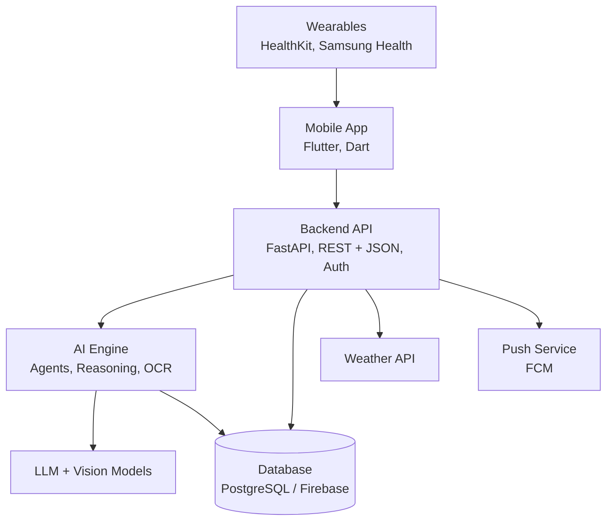

# NOVA Health: High-Level Architecture

**Project:** NOVA Health: AGI-Powered Personal Health Intelligence Companion
**Supervisor:** Mr. Diluka Wijesinghe
**Owner:** W.L.R. Sensith
**Status:** Draft v0.1 (Phase 1, Week 1)

---

## 1. Overview

NOVA Health is a mobile app backed by an API and an AI engine. The app collects health data and shows results. The backend handles auth, data, and notifications. The AI engine builds the user's health context and reasons across all data types.

## 2. Architecture Diagram

**Legend:** Wearables, LLM, Weather, and Push are external services. App, API, AI engine, and database are built by the team.

## 3. Layers

| Layer | Technology | Purpose |
|---|---|---|
| Client | Flutter / Dart | UI, camera capture, local reminders, wearable data reading |
| Backend | Python, FastAPI (or Flask) | Auth, validation, business logic, notifications, weather calls |
| AI engine | LLMs, agentic architecture, OCR, multimodal vision | Health context, cross-domain reasoning, scanning, daily reports |
| Data | PostgreSQL / Firebase | Secure storage of profile and health records |
| External | LLM/vision API, Weather API, FCM, HealthKit, Samsung Health | Third-party services |

## 4. Module Boundaries

| Module | Folder | Owns | Must NOT do |
|---|---|---|---|
| Mobile app | `mobile/` | UI, local reminders, reading HealthKit / Samsung Health, camera capture | Call the AI, database, or external APIs directly |
| Backend API | `backend/` | Auth, validation, business logic, notifications, weather calls | Contain AI reasoning logic |
| AI engine | `ai-engine/` | Health context, cross-domain reasoning, OCR, food analysis, report generation | Handle login or talk to the app directly |
| Database | `backend/` (schema) | Users, profile, medications, symptoms, sleep, mood, water, meals, reports, emergency contacts | Hold business logic |
| External services | none | LLM, vision, weather, push | Receive more personal data than needed |

### Boundary rules

1. The mobile app talks only to the Backend API.
2. The Backend API talks to the AI engine, the database, the weather API, and the push service.
3. The AI engine reads and writes health data through the backend's data layer, never straight from the app.
4. Wearable data flows: watch → phone → app → API. HealthKit and Samsung Health are read on-device only.

## 5. Main Data Flows

### 5.1 Prescription scan

1. User photographs a prescription in the app.
2. App uploads the image to `POST /api/v1/scan/prescription`.
3. Backend validates and forwards it to the AI engine.
4. AI engine runs OCR and a vision model, then returns structured medication data.
5. Backend saves the data and creates reminders.
6. App shows the result for the user to confirm.

### 5.2 Daily health report

1. A scheduled job runs in the backend each day.
2. Backend collects the day's data (food, water, sleep, mood, symptoms, wearables, weather).
3. AI engine reasons across the data and writes the report.
4. Backend stores the report and sends a push notification.
5. App displays the report.

### 5.3 Emergency assistance

1. App or backend detects an abnormal reading.
2. Backend checks the rules and triggers `POST /api/v1/emergency/trigger`.
3. Push service and emergency contact flow are started.
4. Event is logged in the database.

## 6. Security and Privacy

1. All traffic uses HTTPS.
2. Authentication with OAuth / token-based login.
3. Health data encrypted at rest and in transit.
4. Access control: each user can read only their own records.
5. Send external AI services only the data needed for the task.
6. Keys and secrets live in environment variables, never in the repo.
7. Use fake sample data for development and testing.

## 7. Technology Summary

| Area | Choice |
|---|---|
| Mobile | Flutter / Dart |
| Backend | Python, FastAPI or Flask |
| Database | PostgreSQL / Firebase (final choice by database owner) |
| AI | LLMs, agentic architecture, knowledge-based reasoning |
| Vision | OCR and multimodal vision models |
| Wearables | Apple HealthKit, Samsung Health |
| Weather | Weather API (final provider TBD) |
| Notifications | Push (FCM) and local notifications |
| Tools | VS Code, Android Studio, Git/GitHub |

## 8. Open Questions

1. PostgreSQL or Firebase? (owner: database design)
2. Which LLM and vision provider? (owner: AI research)
3. Which weather API? (owner: integrations research)
4. Is Samsung Health API access available for a student project? (owner: integrations research)

## 9. Related Documents

- API contract: `api-contract.md`
