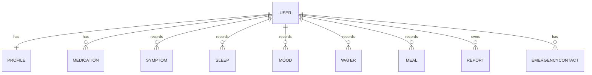

# Database Design

This document describes the database design for the NOVA Health backend (NOVA.Health.API.Server). The descriptions, keys and relationships below are based on the actual Entity Framework Core models and the ApplicationDbContext configuration present in the repository.

All timestamps are stored in UTC (DateTimeOffset / timestamp with time zone where applicable).

## Entities

### User
- Purpose: Represents an authenticated user account and the owner of all health data records.
- Primary key: `User.UserId` (uuid)
- Important fields:
  - `Email` (required, unique)
  - `PasswordHash` (nullable string; stores hashed password, not plaintext)
  - `Role` (string, default "User")
  - `CreatedAt`, `UpdatedAt` (DateTimeOffset)
- Navigation properties: `Profile`, `Medications`, `Symptoms`, `Sleeps`, `Moods`, `Waters`, `Meals`, `Reports`, `EmergencyContacts`.
- Constraints:
  - Unique index on `Email` (enforced by model attribute and migration snapshot).

### Profile
- Purpose: Stores personal/demographic information for a User.
- Primary key: `Profile.ProfileId` (uuid)
- Foreign keys: `Profile.UserId` → `User.UserId` (unique)
- Important fields:
  - `FirstName` (required)
  - `LastName` (nullable)
  - `DateOfBirth` (nullable DateTime)
  - `Gender` (nullable string)
  - `Height`, `Weight` (nullable decimal)
  - `BloodGroup` (nullable string)
  - `CreatedAt`, `UpdatedAt` (DateTimeOffset)
- Relationship: One-to-one with `User` (Profile.UserId is a unique FK). `ApplicationDbContext` enforces a unique index on `Profile.UserId`.

### Medication
- Purpose: User medication records (name, dosage, frequency, dates, notes).
- Primary key: `Medication.MedicationId` (uuid)
- Foreign keys: `Medication.UserId` → `User.UserId`
- Important fields: `Name` (required), `Dosage`, `Frequency`, `StartDate`, `EndDate`, `Notes`, `CreatedAt`.
- Relationship: Many-to-one to `User` (each medication belongs to a user). Indexed on `UserId`.

### Symptom
- Purpose: Symptom entries recorded by a user.
- Primary key: `Symptom.SymptomId` (uuid)
- Foreign keys: `Symptom.UserId` → `User.UserId`
- Important fields: `Name` (required), `Severity` (int, nullable), `Description`, `RecordedAt` (DateTimeOffset)
- Relationship: Many-to-one to `User`. Indexed on `UserId`.

### Sleep (Sleep records)
- Purpose: Sleep session records.
- Model class: `Sleep` (SleepId primary key in codebase)
- Primary key: `Sleep.SleepId` (uuid)
- Foreign keys: `Sleep.UserId` → `User.UserId`
- Important fields: `SleepDate`, `BedTime`, `WakeTime`, `DurationMinutes`, `Quality`, `Notes`
- Relationship: Many-to-one to `User`. Indexed on `UserId`.

> Note: The project model uses class name `Sleep` (not `SleepRecord`). Documentation uses the same names as the code.

### Mood
- Purpose: Mood events recorded by a user.
- Primary key: `Mood.MoodId` (uuid)
- Foreign keys: `Mood.UserId` → `User.UserId`
- Important fields: `MoodType`, `Intensity` (int, nullable), `Notes`, `RecordedAt`
- Relationship: Many-to-one to `User`. Indexed on `UserId`.

### Water
- Purpose: Water intake log entries.
- Primary key: `Water.WaterId` (uuid)
- Foreign keys: `Water.UserId` → `User.UserId`
- Important fields: `AmountMl` (int), `RecordedAt` (DateTimeOffset)
- Relationship: Many-to-one to `User`. Indexed on `UserId`.

### Meal
- Purpose: Meal records and nutrition details.
- Primary key: `Meal.MealId` (uuid)
- Foreign keys: `Meal.UserId` → `User.UserId`
- Important fields: `MealType`, `FoodName`, `Calories`, `Protein`, `Carbohydrates`, `Fat`, `RecordedAt`
- Relationship: Many-to-one to `User`. Indexed on `UserId`.

### Report
- Purpose: Medical reports or files associated with a user.
- Primary key: `Report.ReportId` (uuid)
- Foreign keys: `Report.UserId` → `User.UserId`
- Important fields: `ReportType`, `Title`, `FileUrl`, `ReportDate`, `CreatedAt`
- Relationship: Many-to-one to `User`. Indexed on `UserId`.

### EmergencyContact
- Purpose: Emergency contact details for a user.
- Primary key: `EmergencyContact.EmergencyContactId` (uuid)
- Foreign keys: `EmergencyContact.UserId` → `User.UserId`
- Important fields: `Name` (required), `Relationship`, `PhoneNumber`, `Email`, `Priority`
- Relationship: Many-to-one to `User`. Indexed on `UserId`.

## Relationships (summary)
- `User` 1 — 1 `Profile`
- `User` 1 — * `Medication`
- `User` 1 — * `Symptom`
- `User` 1 — * `Sleep`
- `User` 1 — * `Mood`
- `User` 1 — * `Water`
- `User` 1 — * `Meal`
- `User` 1 — * `Report`
- `User` 1 — * `EmergencyContact`

The relationship model and constraints match the `ApplicationDbContext` and are captured in the existing EF Core migration snapshot present in `Migrations/`.

## Constraints and indexes
- Unique index on `User.Email` (code attribute and migration snapshot).
- Unique index on `Profile.UserId` to enforce 1:1.
- Indexes on `UserId` for all child tables to optimize per-user queries.
- Foreign key constraints enforce referential integrity.

---

## ERD (Mermaid)

## PostgreSQL vs Firebase (short rationale)

- PostgreSQL (used in this project) is a relational database that suits NOVA Health because:
  - Health data is naturally relational (users own many typed records) and benefits from foreign keys and ACID guarantees.
  - Referential integrity (FK constraints) preserves ownership relationships and prevents orphaned records.
  - PostgreSQL supports strong indexing (B-tree, GIN) and advanced queries for reporting, analytics and aggregation required by an AI engine.
  - EF Core has mature Npgsql provider which integrates migrations, LINQ-based queries, and type mapping (DateTimeOffset → timestamp with time zone).
  - PostgreSQL scales with read replicas and partitioning strategies for time-series health data.

- Firebase (NoSQL) may simplify real-time sync but lacks built-in relational constraints which are important for medical data integrity. For NOVA Health, PostgreSQL is the appropriate choice.

---

*Document created from the actual repository files: `Models/`, `Data/ApplicationDbContext.cs` and `Migrations/`.*
